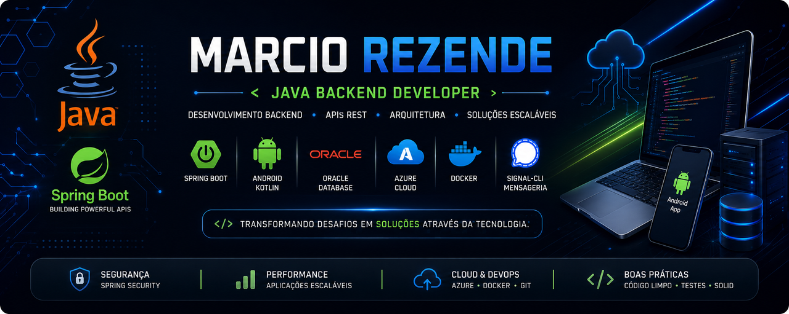

  

  # Marcio Rezende
  ### Desenvolvedor Java | Spring Boot | Android | Cloud

  *Transformando desafios em soluções através da tecnologia.*

  

 

## Sobre mim

Desenvolvedor Java com Pós-Graduação em Arquitetura e Desenvolvimento Java pela **FIAP (Pós-Tech)**, com experiência em aplicações Web, Mobile e integrações entre sistemas.

Construo soluções completas com **Spring Boot, Android (Kotlin), APIs REST e mensageria**, focadas em automação de processos e comunicação em tempo real.

 

## Stack

**Backend**

**Banco de Dados**

**Mobile & Front-end**

**Cloud & Ferramentas**

 

## Projetos em destaque

**🛠 Sistema Corporativo de Gestão de Manutenção**
Sistema completo em Java + Spring Boot para clientes, máquinas, solicitações e execução de serviços — com autenticação, dashboard, relatórios em PDF e API REST.

**💬 Mensageria com Signal**
Integração via Signal-CLI para notificação automática de solicitações e execuções em grupos, eliminando trabalho manual de comunicação entre equipes.

**📱 Controle DB Android**
App em Kotlin para gerenciamento de equipamentos em campo, integrado ao backend via REST, com upload de imagens e Material Design.

**📄 PDF Generator**
Geração dinâmica de documentos PDF personalizados com iText.

 

## GitHub Stats

  
  

  

 

## Contato

⭐ Se algum projeto foi útil, deixe uma estrela no repositório!

